# 🚀 SinggahLuhh

> Cari, jejak, dan kongsi tempat solat berhampiran anda. Community-driven mosque, surau, and musolla discovery and visit-tracking app for Malaysia.


---

## 📖 Table of Contents

- [Overview](#-overview)
- [Features](#-features)
- [Tech Stack](#-tech-stack)
- [Architecture](#-architecture)
- [User Flow](#-user-flow)
- [Auth Flow](#-auth--session-flow)
- [Database](#-database-erd)
- [API Structure](#-api-structure)
- [Frontend Components](#-frontend-components)
- [Feature Flows](#-feature-specific-flows)
- [Getting Started](#-getting-started)
- [Environment Variables](#-environment-variables)
- [Deployment](#-deployment)
- [Project Structure](#-project-structure)
- [Roadmap](#-roadmap)
- [License](#-license)

---

## 🧭 Overview

SinggahLuhh is a community-driven mosque, surau, and musolla discovery and visit-tracking app for Malaysia. Users discover prayer places, check in to earn streaks and reputation, contribute facility info, share real-time crowd updates, form prayer groups with friends, and track personal ibadah — all wrapped in gamification that rewards the Malaysian jemaah spirit.

**Type:** `Solo`
**Brand:** `Luhh Series`
**Built with:** Independent

---

## ✨ Features

### Discovery & Exploration
- ✅ Browse masjid, surau, and musolla with search and filters (type, state, facilities)
- ✅ Trending Masjid section — weekly computed score based on engagement
- ✅ Map view with all prayer places plotted (PostGIS geospatial queries)
- ✅ Slug-based URLs for easy sharing

### Visit Tracking (Langkah)
- ✅ GPS check-in with geofencing (must be within 200 m)
- ✅ Track prayer type: Subuh, Zohor, Asar, Maghrib, Isyak, Jumaat, Terawih, Iftar, Kuliah
- ✅ Daily streak tracking + longest streak badge
- ✅ Visit history with calendar heatmap

### Gamification & Reputation
- ✅ Reputation Points earned via contributions (check-ins, facility edits, photos, votes)
- ✅ Achievement Badges (Subuh Warrior, Musafir Tegar, Masjid Hunter, etc.)
- ✅ Leaderboard filterable by Malaysian state (name-censored for privacy)
- ✅ Badge progress tracking and achievement notifications

### Malaysian-Specific Facilities
- ✅ Cooling system, Kucing count, Talam gang flag, Parking availability
- ✅ Wanita facilities (telekung, cleanliness), Food & Iftar details
- ✅ Terawih rakaat count, Amenities (toilet, Coway dispenser), Family-friendly indicators

### Community Content
- ✅ Events — post community events (khutbah, kuliah, program Ramadan) with type + datetime
- ✅ Announcements — post notices with categories (umum, solat, kemudahan, kebersihan, keselamatan)
- ✅ Lost & Found — report lost/found items; poster can mark as resolved
- ✅ Iftar Thread — rate and describe iftar experience (seasonal, by star rating)
- ✅ Live Crowdsourced Updates — real-time conditions (saf status, parking, crowd level); auto-expire after 45 min

### Bookmarks & Wishlist
- ✅ Save prayer places to personal bookmark list
- ✅ Mark places as "Nak Pergi" (wishlist) — toggle between saved and wishlist

### Prayer Groups & Buddy System
- ✅ Create groups (up to 10 members) or buddy pairs (2 people)
- ✅ Unique 8-character alphanumeric invite code per group
- ✅ Share via WhatsApp or copy invite code
- ✅ Group members + recent activity feed visible

### Personal Ibadah Tracker
- ✅ **Khatam Al-Quran** — log progress by juz, surah, and ayah with optional notes
- ✅ **Solat Sunat** — log tahajjud, dhuha, hajat, witir, istikharah, taubat, syukur, etc. with rakaat count

### Personal Diary
- ✅ Write private visit notes for any prayer place
- ✅ Chronological diary entries per masjid, visible only to you

### PWA & Offline Support
- ✅ Installable on mobile as native-like app
- ✅ Service worker for offline capability

### Auth & Moderation
- ✅ Email + password signup with 6-digit OTP email verification
- ✅ Forgot password via email reset link
- ✅ Community verification (upvote/downvote submissions; auto-verify at 3+ upvotes)
- ✅ Report system for inappropriate content / wrong info (admin panel to resolve)

### Other
- 🚧 Feedback form (floating button, always accessible)
- 💡 FAQ, Changelog, Privacy Policy, Terms pages

---

## 🛠 Tech Stack

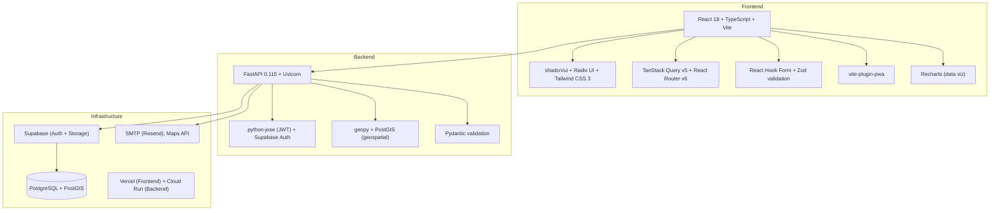

| Layer | Technology |
|---|---|
| Frontend | React 18 + TypeScript, Vite 7, React Router v6, TanStack Query v5 |
| UI/Styling | shadcn/ui, Radix UI, Tailwind CSS 3, next-themes |
| Form Handling | React Hook Form, Zod |
| Backend | FastAPI 0.115, Uvicorn |
| Auth | python-jose (JWT), Supabase Auth |
| Database | PostgreSQL + PostGIS (geospatial) |
| Storage | Supabase Storage (photo uploads) |
| Hosting | Vercel (frontend), Cloud Run (backend) |
| External | Resend (SMTP), Google Maps API |

---

## 📌 Architecture

### High-level Architecture

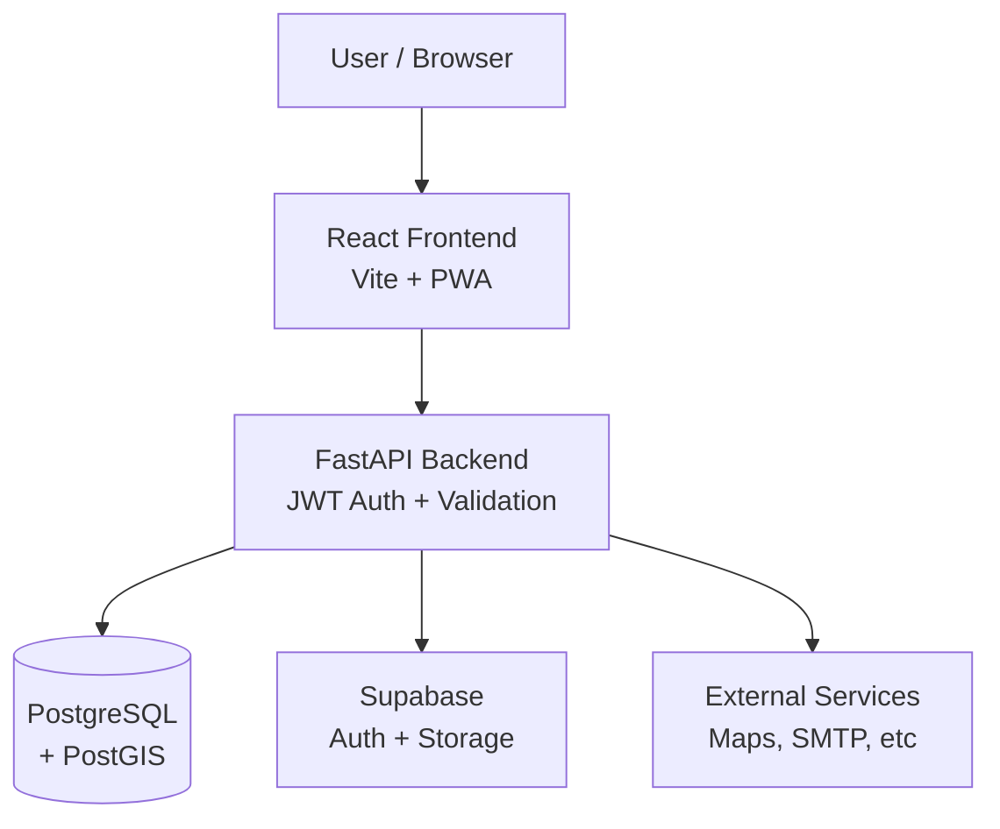
<!--
PROMPT FOR CLAUDE CODE:
Generate a high-level architecture diagram in Mermaid graph TD for SinggahLuhh.
Include: React frontend (PWA), FastAPI backend (with JWT), PostgreSQL + PostGIS, Supabase (Auth + Storage), external services (Maps, SMTP).
Use subgraph to group frontend, backend, database layers.
-->

### System Architecture

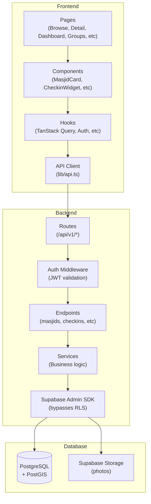
<!--
PROMPT FOR CLAUDE CODE:
Generate a detailed system architecture diagram in Mermaid graph TD for SinggahLuhh.
Include all layers: frontend (pages → components → hooks → API client), backend (routes → auth middleware → controllers → services → Supabase SDK), database (PostgreSQL + PostGIS), storage.
Use subgraph to group each layer clearly.
Show data flow arrows between layers.
-->

---

## 👤 User Flow

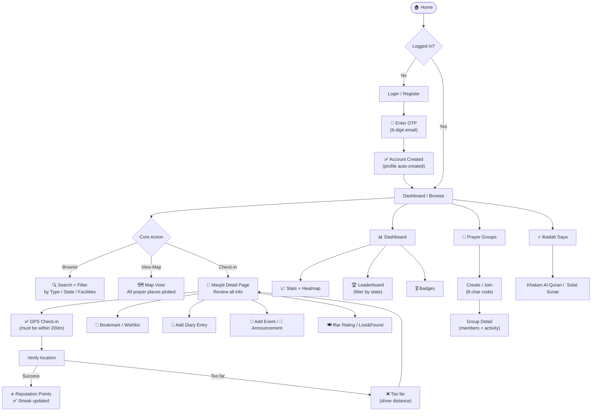
<!--
PROMPT FOR CLAUDE CODE:
Generate a user flow diagram in Mermaid flowchart TD for SinggahLuhh.
Cover: landing → auth → browse/discover → GPS check-in (with geofence validation) → reputation earned → dashboard → leaderboard → prayer groups → ibadah tracker.
Include decision nodes for auth state, geofence validation, error states.
Use emojis to make it visually distinct.
-->

### Page Map

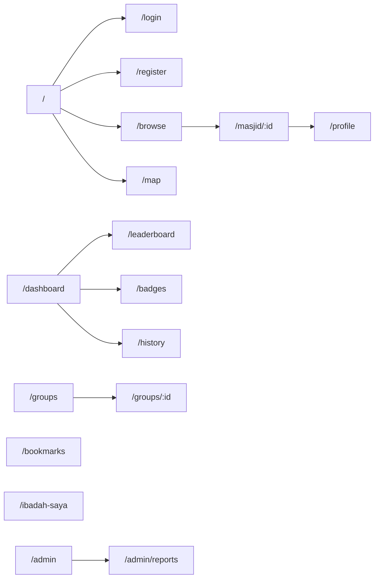
<!--
PROMPT FOR CLAUDE CODE:
Generate a page map in Mermaid graph LR for SinggahLuhh.
List all frontend routes: public (/, /login, /register, /browse, /map, /masjid/:id), protected (/dashboard, /profile, /groups, /bookmarks, /ibadah-saya, /admin).
Show navigation connections between them.
Group protected vs public routes visually.
-->

### Wireframe Overview

```mermaid
graph TD
    subgraph Home ["🏠 Home / Landing"]
        H1["Header (nav + auth)"]
        H2["Hero + CTA"]
        H3["📊 Stats bar (total masjids / visits)"]
        H4["🔥 Trending Minggu Ini (horizontal scroll)"]
        H5["🌟 Popular Masjids (grid)"]
        H1 --> H2 --> H3 --> H4 --> H5
    end

    subgraph Browse ["🔍 Browse Masjid"]
        B1["Search input"]
        B2["Type chips (Masjid · Surau · Musolla)"]
        B3["Facility filter tags (scrollable)"]
        B4["State filter"]
        B5["Sort toggle (distance / rating / trending)"]
        B6["MasjidCard grid (cover photo + badges)"]
        B1 --> B2 --> B3 --> B4 --> B5 --> B6
    end

    subgraph Detail ["📍 Masjid Detail"]
        D1["Photo gallery"]
        D2["Name · Type · Address · Status"]
        D3["✅ GPS Check-in button"]
        D4["🔖 Bookmark / 💭 Wishlist toggles"]
        D5["⭐ Verification status + upvote/downvote"]
        D6["🏠 Facilities panel (expandable)"]
        D7["📢 Live Updates (auto-expire)"]
        D8["📅 Events + 📢 Announcements + 🍽️ Iftar Thread"]
        D9["📔 Diary + 🔍 Lost&Found"]
        D1 --> D2 --> D3 --> D4 --> D5 --> D6 --> D7 --> D8 --> D9
    end

    subgraph Dashboard ["📊 Dashboard"]
        K1["👤 User welcome + stats (total visits · streak · unique)"]
        K2["📊 Visit calendar heatmap"]
        K3["🎖️ Badges earned (grid)"]
        K4["🏆 Leaderboard (state filter + censored names)"]
        K5["📋 Visit history (latest first)"]
        K1 --> K2 --> K3 --> K4 --> K5
    end

    subgraph Groups ["👥 Prayer Groups"]
        G1["Buat Kumpulan / Join dengan Kod buttons"]
        G2["My Groups list"]
        G3["Group Detail (members list)"]
        G4["🔗 Invite code (large mono) + Copy + WhatsApp"]
        G5["📊 Recent group activity feed"]
        G1 --> G2 --> G3 --> G4 --> G5
    end
```
<!--
PROMPT FOR CLAUDE CODE:
Generate a wireframe overview diagram in Mermaid graph TD for SinggahLuhh.
Use one subgraph per major page: Home, Browse, MasjidDetail, Dashboard, Groups, etc.
Inside each subgraph, list the main UI sections in order (top to bottom).
Label each subgraph with emoji + page name.
Make it detailed enough to understand page structure at a glance.
-->

---

## 🔐 Auth & Session Flow

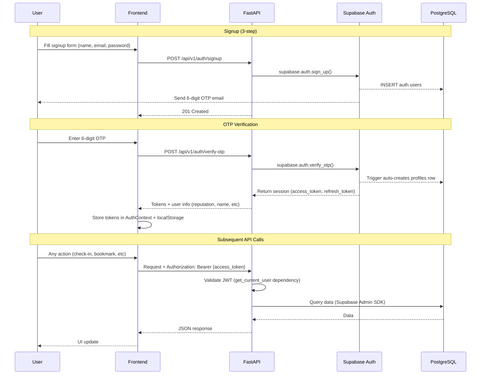
<!--
PROMPT FOR CLAUDE CODE:
Generate a full auth sequence diagram in Mermaid sequenceDiagram for SinggahLuhh.
Cover: 3-step signup → OTP verification → profile auto-created → login → token storage → subsequent API calls.
Use participant labels: User, Frontend, Backend (FastAPI), Supabase Auth, PostgreSQL.
Show token flow, localStorage storage, and middleware validation.
-->

### Token Lifecycle

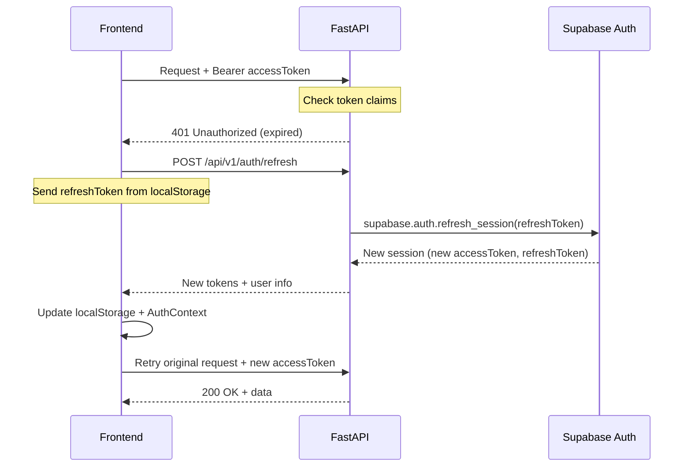
<!--
PROMPT FOR CLAUDE CODE:
Generate a token lifecycle / refresh flow diagram in Mermaid sequenceDiagram for SinggahLuhh.
Show: authenticated request → 401 expiry → silent refresh from localStorage → token validation → retry.
Include what's stored in localStorage (access_token, refresh_token, user object).
Cover both successful refresh and token rotation.
-->

---

## 🗄️ Database (ERD)

### Core ERD

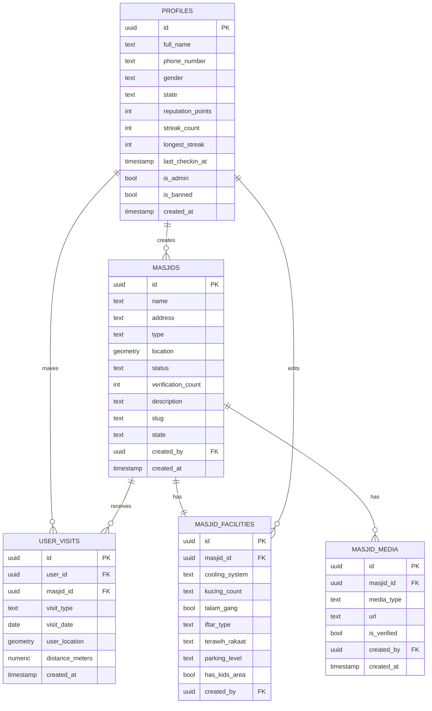
<!--
PROMPT FOR CLAUDE CODE:
Generate a core ERD in Mermaid erDiagram format for SinggahLuhh.
Include primary tables: profiles (auth + reputation), masjids (prayer places), masjid_facilities, masjid_media, user_visits (check-ins).
Show: column name, data type, PK/FK annotations.
Show relationships with correct cardinality.
Use geometry for location columns (PostGIS).
-->

### Feature / Social ERD

```mermaid
erDiagram
    BOOKMARKS {
        uuid id PK
        uuid user_id FK
        uuid masjid_id FK
        bool is_wishlist
        timestamp created_at
    }

    DIARY_ENTRIES {
        uuid id PK
        uuid user_id FK
        uuid masjid_id FK
        text content
        date visit_date
        timestamp created_at
    }

    KHATAM_LOGS {
        uuid id PK
        uuid user_id FK
        int juz
        int surah_from
        int ayah_from
        int surah_to
        int ayah_to
        text notes
        timestamp created_at
    }

    SPECIAL_PRAYER_LOGS {
        uuid id PK
        uuid user_id FK
        text prayer_type
        int rakaat
        text notes
        timestamp created_at
    }

    EVENTS {
        uuid id PK
        uuid masjid_id FK
        uuid user_id FK
        text title
        text event_type
        timestamp starts_at
        text description
        timestamp created_at
    }

    ANNOUNCEMENTS {
        uuid id PK
        uuid masjid_id FK
        uuid user_id FK
        text title
        text body
        text category
        timestamp expires_at
        timestamp created_at
    }

    LOST_FOUND_POSTS {
        uuid id PK
        uuid masjid_id FK
        uuid user_id FK
        text description
        bool is_resolved
        timestamp created_at
    }

    IFTAR_THREADS {
        uuid id PK
        uuid masjid_id FK
        uuid user_id FK
        text iftar_type
        text description
        int rating
        timestamp created_at
    }

    LIVE_UPDATES {
        uuid id PK
        uuid masjid_id FK
        uuid user_id FK
        text update_type
        text value
        timestamp expires_at
        timestamp created_at
    }

    PRAYER_GROUPS {
        uuid id PK
        text name
        text type
        text invite_code
        uuid created_by FK
        int max_members
        timestamp created_at
    }

    PRAYER_GROUP_MEMBERS {
        uuid id PK
        uuid group_id FK
        uuid user_id FK
        text role
        timestamp joined_at
    }

    VERIFICATIONS {
        uuid id PK
        uuid masjid_id FK
        uuid user_id FK
        text vote_type
        text reason
        timestamp created_at
    }

    BADGES {
        uuid id PK
        text code
        text name
        text description
        text icon
        text requirement_type
        int requirement_value
    }

    USER_BADGES {
        uuid id PK
        uuid user_id FK
        uuid badge_id FK
        timestamp earned_at
    }

    PROFILES ||--o{ BOOKMARKS : "saves"
    PROFILES ||--o{ DIARY_ENTRIES : "writes"
    PROFILES ||--o{ KHATAM_LOGS : "logs"
    PROFILES ||--o{ SPECIAL_PRAYER_LOGS : "logs"
    PROFILES ||--o{ EVENTS : "posts"
    PROFILES ||--o{ ANNOUNCEMENTS : "posts"
    PROFILES ||--o{ LOST_FOUND_POSTS : "posts"
    PROFILES ||--o{ IFTAR_THREADS : "posts"
    PROFILES ||--o{ LIVE_UPDATES : "posts"
    PROFILES ||--o{ VERIFICATIONS : "votes"
    PROFILES ||--o{ PRAYER_GROUPS : "creates"
    PROFILES ||--o{ PRAYER_GROUP_MEMBERS : "joins"
    PROFILES ||--o{ USER_BADGES : "earns"
    MASJIDS ||--o{ BOOKMARKS : "bookmarked"
    MASJIDS ||--o{ DIARY_ENTRIES : "has"
    MASJIDS ||--o{ EVENTS : "has"
    MASJIDS ||--o{ ANNOUNCEMENTS : "has"
    MASJIDS ||--o{ LOST_FOUND_POSTS : "has"
    MASJIDS ||--o{ IFTAR_THREADS : "has"
    MASJIDS ||--o{ LIVE_UPDATES : "receives"
    MASJIDS ||--o{ VERIFICATIONS : "receives"
    PRAYER_GROUPS ||--o{ PRAYER_GROUP_MEMBERS : "has"
    BADGES ||--o{ USER_BADGES : "awarded via"
```
<!--
PROMPT FOR CLAUDE CODE:
Generate a feature/social ERD in Mermaid erDiagram format for SinggahLuhh.
Include: bookmarks, diary_entries, khatam_logs, special_prayer_logs, events, announcements, lost_found_posts, iftar_threads, live_updates, prayer_groups, prayer_group_members, verifications, badges, user_badges.
Show relationships back to profiles and masjids.
Show all columns with types.
This is the "social / community" ERD (separate from core ERD).
-->

### Database Schema Overview

| Table | Purpose | Key Relations |
|---|---|---|
| `profiles` | User auth + reputation + streaks | — |
| `masjids` | Prayer place records | created_by: profiles |
| `masjid_facilities` | Detailed facility info per masjid | masjid_id, created_by |
| `masjid_media` | Photos (main, interior, etc) | masjid_id |
| `user_visits` | Check-in records (Langkah) | user_id, masjid_id |
| `bookmarks` | Saved / wishlist places | user_id, masjid_id |
| `diary_entries` | Personal notes per visit | user_id, masjid_id |
| `events` | Community events (khutbah, kuliah) | masjid_id, user_id |
| `announcements` | Masjid notices | masjid_id, user_id |
| `live_updates` | Real-time conditions (45 min expiry) | masjid_id, user_id |
| `iftar_threads` | Seasonal iftar ratings | masjid_id, user_id |
| `lost_found_posts` | Lost & found items | masjid_id, user_id |
| `khatam_logs` | Quran reading progress | user_id |
| `special_prayer_logs` | Solat sunat tracking | user_id |
| `prayer_groups` | User-created groups (max 10 members) | created_by |
| `prayer_group_members` | Group membership | group_id, user_id |
| `badges` | Badge definitions | — |
| `user_badges` | Badge achievements | user_id, badge_id |
| `verifications` | Community upvote/downvote | masjid_id, user_id |

---

## 🔌 API Structure

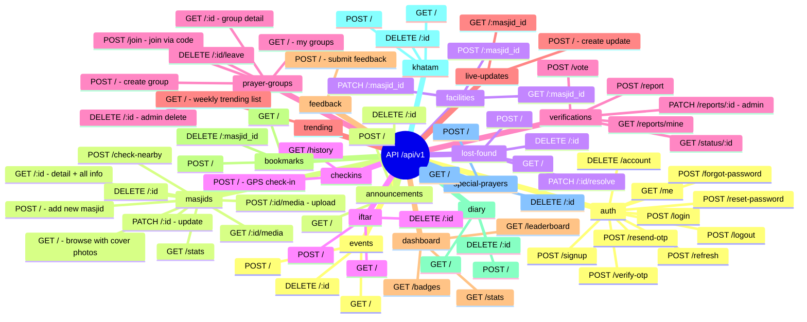
<!--
PROMPT FOR CLAUDE CODE:
Generate an API mindmap in Mermaid mindmap format for SinggahLuhh.
Group all endpoints by domain: auth, masjids, facilities, checkins, verifications, live-updates, dashboard, bookmarks, diary, khatam, special-prayers, events, announcements, lost-found, iftar, prayer-groups, trending, feedback.
Show HTTP method + path for each endpoint.
Use mindmap because there are 60+ endpoints across 18 domains.
-->

### Request/Response Flow (Check-in Example)

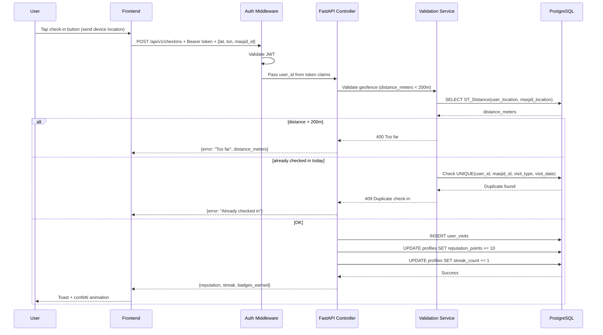
<!--
PROMPT FOR CLAUDE CODE:
Generate a request/response flow diagram in Mermaid sequenceDiagram for SinggahLuhh check-in feature.
Show: frontend → auth middleware → controller → geofence validation → DB query → update reputation + streak → success/error paths.
Include error paths (too far, duplicate, unauthorized).
-->

---

## 🧩 Frontend Components

### Component Tree

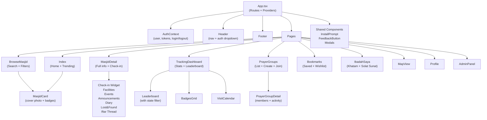
<!--
PROMPT FOR CLAUDE CODE:
Generate a component tree in Mermaid graph TD for SinggahLuhh.
Show hierarchy: App → Providers (AuthContext) → Header/Footer → Pages (Index, Browse, Detail, Dashboard, Groups, Bookmarks, Ibadah, Map, Profile, Admin).
Include Detail page sections (Check-in, Facilities, Events, etc) as sub-nodes.
Include shared components (MasjidCard, Leaderboard, InstallPrompt, FeedbackButton).
-->

### Key Components

| Component | Purpose |
|---|---|
| `AuthContext` | Global auth state (user, tokens, login/logout/refresh) |
| `ProtectedRoute` | Redirects to login if not authenticated |
| `Header` | Navigation bar + auth dropdown + mobile menu |
| `MasjidCard` | Prayer place preview (cover photo, type, verification status, badges) |
| `MasjidDetail` | Full masjid view: all facilities, events, announcements, check-in, community content |
| `CheckinWidget` | GPS check-in button + geofence validation feedback |
| `FacilitiesPanel` | Expandable Malaysian-specific facility details |
| `LiveUpdates` | Real-time conditions (auto-expiring, 45 min) |
| `VerificationPanel` | Upvote/downvote submission + report form |
| `EventsList` & `AnnouncementsList` | Community event/notice display + creation forms |
| `DiaryEntry` | Personal visit notes (private) |
| `LostFoundThread` & `IftarThread` | Community posts |
| `TrackingDashboard` | User stats, visit heatmap, badges, leaderboard |
| `Leaderboard` | Top users by reputation, state-filtered, name-censored |
| `BadgesGrid` | Achievement badges with progress |
| `PrayerGroups` | Create/join groups with invite codes |
| `PrayerGroupDetail` | Group members + recent activity + WhatsApp share |
| `Bookmarks` | Saved places + wishlist tabs |
| `IbadahSaya` | Khatam Al-Quran + Solat Sunat tabs |
| `MapView` | Masjid locations plotted on map (PostGIS) |
| `InstallPrompt` | PWA installation banner (iOS + Android) |
| `FeedbackButton` | Always-visible feedback form |

---

## ⚙️ Feature-specific Flows

### Check-in Flow (Langkah)

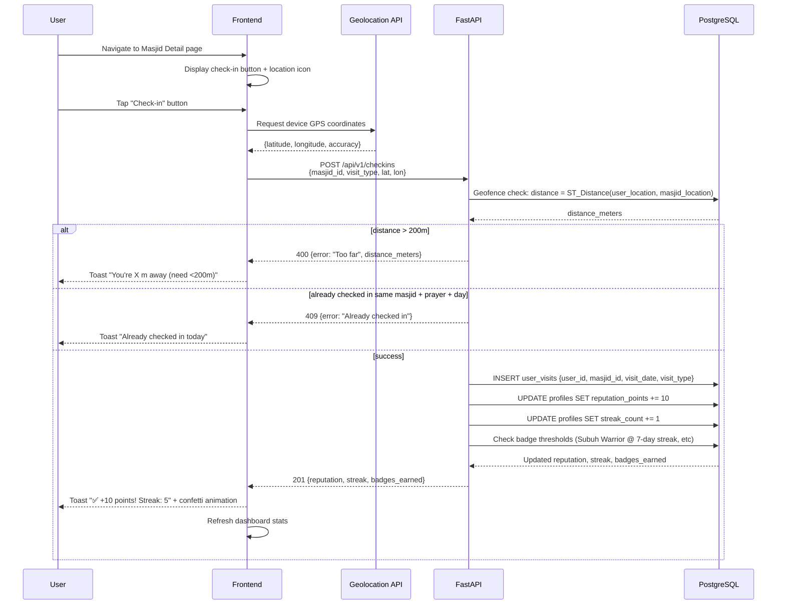
<!--
PROMPT FOR CLAUDE CODE:
Generate a check-in flow sequence diagram in Mermaid sequenceDiagram for SinggahLuhh.
Show: user taps check-in → request device GPS → geofence validation (distance < 200m) → check duplicate (same masjid + prayer + date) → success path (insert visit, update reputation + streak, check badge thresholds) → error paths (too far, duplicate).
Include exact point values (Subuh 15 pts, other prayers 10 pts).
-->

### Gamification & Points Flow

```mermaid
flowchart TD
    A([User Action]) --> B{Action Type?}
    
    B -->|Subuh Check-in| C["➕ 15 Points"]
    B -->|Other Prayer Check-in| D["➕ 10 Points"]
    B -->|Add Facility Info| E["➕ 10 Points"]
    B -->|Post Live Update| F["➕ 5 Points"]
    B -->|Vote (upvote/downvote)| G["➕ 5 Points"]
    B -->|Upload Photo| H["➕ 5 Points"]
    
    C --> I["Update reputation_points"]
    D --> I
    E --> I
    F --> I
    G --> I
    H --> I
    
    I --> J{Check Badge Thresholds}
    
    J -->|7-day streak| K["🎖️ Subuh Warrior"]
    J -->|3 different states| L["🎖️ Musafir Tegar"]
    J -->|5 mosque facilities| M["🎖️ Kucing Lover"]
    J -->|20 terawih check-ins| N["🎖️ Ramadan Champion"]
    J -->|50 unique mosques| O["🎖️ Masjid Hunter"]
    J -->|First iftar update| P["🎖️ AJK Iftar"]
    
    K --> Q["Award badge + notify user"]
    L --> Q
    M --> Q
    N --> Q
    O --> Q
    P --> Q
    
    J -->|No threshold met| R([Done])
    Q --> R
```
<!--
PROMPT FOR CLAUDE CODE:
Generate a gamification flow diagram in Mermaid flowchart TD for SinggahLuhh.
Show: user action → points awarded (Subuh 15, prayers 10, facilities 10, updates 5, votes 5, photos 5) → reputation update → badge threshold check → award badge if met.
List all badges: Subuh Warrior (7-day streak), Musafir Tegar (3 states), Kucing Lover (5 mosques), AJK Iftar (first), Ramadan Champion (20 terawih), Masjid Hunter (50 unique).
-->

### Community Verification Flow

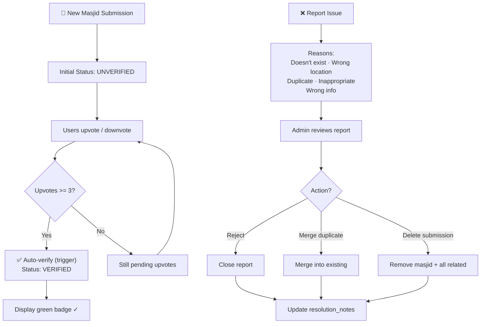
<!--
PROMPT FOR CLAUDE CODE:
Generate a community verification flow in Mermaid flowchart TD for SinggahLuhh.
Show: masjid submission → unverified → users upvote/downvote → auto-verify at 3+ upvotes → verified badge.
Include report flow: report reasons → admin review → action (reject, merge, delete) → resolution notes.
-->

### Role & Permission Matrix

| Action | Owner | Admin | Member | Guest |
|---|---|---|---|---|
| Create masjid | ✅ | ✅ | ❌ | ❌ |
| Edit masjid | ✅ | ✅ | ❌ | ❌ |
| Delete masjid | ✅ | ✅ | ❌ | ❌ |
| Add facilities | ✅ | ✅ | ✅ | ❌ |
| Add event | ✅ | ✅ | ✅ | ❌ |
| Add announcement | ✅ | ✅ | ✅ | ❌ |
| Check-in | ✅ | ✅ | ✅ | ❌ |
| Vote verification | ✅ | ✅ | ✅ | ❌ |
| Report masjid | ✅ | ✅ | ✅ | ❌ |
| Resolve reports | ❌ | ✅ | ❌ | ❌ |
| Ban user | ❌ | ✅ | ❌ | ❌ |
| View dashboard | ✅ | ✅ | ✅ | ❌ |
| Create prayer group | ✅ | ✅ | ✅ | ❌ |
| View leaderboard | ✅ | ✅ | ✅ | ✅ |
| Browse masjid | ✅ | ✅ | ✅ | ✅ |

---

## 🚀 Getting Started

### Prerequisites

- Node.js `>=18`
- Python `>=3.11`
- Docker + Docker Compose (for local development)
- Git

### Installation

```bash
git clone https://github.com/syaqirah/SinggahLuhh.git
cd SinggahLuhh

# Install frontend dependencies
cd frontend
npm install

# Install backend dependencies
cd ../backend
pip install -r requirements.txt
```

### Running locally

#### With Docker (Recommended)

```bash
# Development (hot reload for both frontend + backend)
docker compose up --build

# Frontend: http://localhost:5173
# Backend API: http://localhost:8000
# API Docs: http://localhost:8000/docs
```

#### Without Docker

```bash
# Terminal 1: Frontend (from frontend/)
npm run dev
# http://localhost:5173

# Terminal 2: Backend (from backend/)
python -m uvicorn app.main:app --reload --port 8000
# http://localhost:8000
```

### Running with Docker

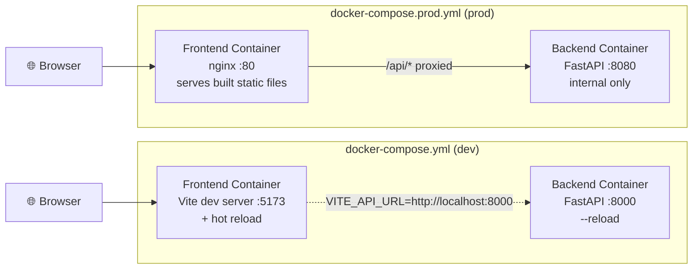
<!--
PROMPT FOR CLAUDE CODE:
Generate a Docker Compose dev vs prod diagram in Mermaid graph LR for SinggahLuhh.
Show two subgraphs: Dev (Vite with hot reload, both ports exposed) and Prod (nginx, internal backend).
Include port numbers, volume mounts, and proxy configuration.
Show browser connections to each.
-->

**Development (hot reload)**

```bash
docker compose up --build
```

| Service | URL |
|---|---|
| Frontend (Vite) | http://localhost:5173 |
| Backend (FastAPI) | http://localhost:8000 |
| API Docs (Swagger) | http://localhost:8000/docs |
| ReDoc | http://localhost:8000/redoc |

**Production**

```bash
docker compose -f docker-compose.prod.yml up --build
```

| Service | URL |
|---|---|
| App (nginx) | http://localhost:80 |
| Backend (internal) | — |

---

## 🔑 Environment Variables

### Backend (`backend/.env`)

```env
# App
APP_NAME=SinggahLuhh API
APP_VERSION=1.0.0
DEBUG=true
ENVIRONMENT=development

# Supabase
SUPABASE_URL=https://<project>.supabase.co
SUPABASE_ANON_KEY=<anon key>
SUPABASE_SERVICE_KEY=<service role key>

# Security
SECRET_KEY=<generate: openssl rand -hex 32>
ALGORITHM=HS256
ACCESS_TOKEN_EXPIRE_MINUTES=30
REFRESH_TOKEN_EXPIRE_DAYS=7

# CORS
ALLOWED_ORIGINS=["http://localhost:5173"]

# Email (SMTP)
SMTP_HOST=smtp.resend.com
SMTP_PORT=587
SMTP_USER=resend
SMTP_PASSWORD=<resend API key>
EMAIL_FROM=noreply@singgahluhh.my

# Business Rules
MASJID_VERIFY_THRESHOLD=3
MASJID_DUPLICATE_RADIUS_METERS=100
GEOFENCE_RADIUS_METERS=200
LIVE_UPDATE_EXPIRY_MINUTES=45
```

### Frontend (`frontend/.env`)

```env
VITE_API_URL=http://localhost:8000
VITE_SUPABASE_URL=https://<project>.supabase.co
VITE_SUPABASE_ANON_KEY=<anon key>
VITE_GOOGLE_MAPS_API_KEY=<Google Maps API key>
```

> Copy `.env.example` files in both directories and fill in your values.

---

## ☁️ Deployment

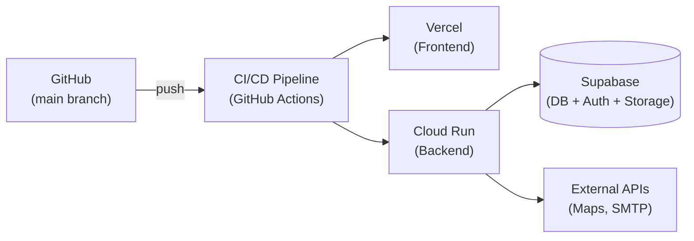
<!--
PROMPT FOR CLAUDE CODE:
Generate a deployment diagram in Mermaid graph LR for SinggahLuhh.
Show: GitHub push → CI/CD pipeline (GitHub Actions) → Vercel (frontend) + Cloud Run (backend).
Show backend connections to Supabase and external services.
Include platform names and what each hosts.
-->

| Service | Platform | Purpose |
|---|---|---|
| Frontend | Vercel | React SPA + PWA hosting |
| Backend | Cloud Run | FastAPI containerized app |
| Database | Supabase (PostgreSQL) | Auth + Data + Storage |
| Email | Resend | OTP + password reset emails |
| Maps | Google Maps API | Map view + geospatial queries |

**Deploy Frontend:**

```bash
vercel --prod
```

**Deploy Backend:**

```bash
gcloud builds submit --tag gcr.io/[PROJECT_ID]/singgahluhh-api
gcloud run deploy singgahluhh-api --image gcr.io/[PROJECT_ID]/singgahluhh-api --platform managed
```

---

## 📁 Project Structure

```
SinggahLuhh/
├── docker-compose.yml              # Dev: Vite + FastAPI with hot reload
├── docker-compose.prod.yml         # Prod: nginx + FastAPI
├── README.md
│
├── frontend/
│   ├── Dockerfile                  # Multi-stage: dev (Vite) + prod (nginx)
│   ├── nginx.conf                  # SPA routing + /api proxy
│   ├── vite.config.ts
│   ├── tailwind.config.ts
│   ├── tsconfig.json
│   ├── .env.example
│   ├── package.json
│   └── src/
│       ├── main.tsx
│       ├── App.tsx                 # All routes + providers
│       ├── types/
│       │   └── index.ts            # Masjid, Visit, Badge, etc
│       ├── contexts/
│       │   └── AuthContext.tsx     # Global auth state
│       ├── lib/
│       │   ├── api.ts              # All API calls
│       │   ├── constants.ts        # MALAYSIA_STATES, FACILITY_OPTIONS, etc
│       │   └── utils.ts            # Helper functions
│       ├── hooks/
│       │   └── use-toast.ts
│       ├── components/
│       │   ├── Header.tsx
│       │   ├── Footer.tsx
│       │   ├── MasjidCard.tsx
│       │   ├── InstallPrompt.tsx
│       │   └── FeedbackButton.tsx
│       └── pages/
│           ├── Index.tsx           # Home + Trending
│           ├── BrowseMasjid.tsx
│           ├── MasjidDetail.tsx
│           ├── TrackingDashboard.tsx
│           ├── MapView.tsx
│           ├── Bookmarks.tsx
│           ├── IbadahSaya.tsx
│           ├── PrayerGroups.tsx
│           ├── PrayerGroupDetail.tsx
│           ├── Profile.tsx
│           ├── AdminPanel.tsx
│           ├── Auth.tsx
│           ├── PrivacyPolicy.tsx
│           ├── Terms.tsx
│           ├── FAQ.tsx
│           ├── Changelog.tsx
│           └── NotFound.tsx
│
└── backend/
    ├── Dockerfile
    ├── requirements.txt
    ├── .env.example
    ├── .gitignore
    └── app/
        ├── main.py                 # FastAPI app, CORS, lifespan
        ├── core/
        │   ├── config.py           # Settings (pydantic-settings)
        │   ├── deps.py             # get_current_user() dependency
        │   └── supabase.py         # Admin + anon client factory
        ├── schemas/
        │   └── base.py             # CamelModel, response schemas
        └── api/v1/
            ├── router.py           # Master router
            └── endpoints/
                ├── auth.py
                ├── masjids.py      # Browse, detail, add, edit, delete
                ├── facilities.py
                ├── checkin.py      # GPS check-in with geofence
                ├── live_updates.py
                ├── verification.py # Upvote/downvote + reports
                ├── dashboard.py    # Stats, badges, leaderboard
                ├── profile.py
                ├── bookmarks.py
                ├── diary.py
                ├── khatam.py
                ├── special_prayers.py
                ├── events.py
                ├── announcements.py
                ├── lost_found.py
                ├── iftar.py
                ├── trending.py     # Weekly trending compute
                ├── prayer_groups.py
                └── feedback.py
```

---

## 🗺 Roadmap

- [x] Core MVP (masjid browse, check-in, reputation)
- [x] Community features (events, announcements, lost & found)
- [x] Gamification (badges, leaderboard, streaks)
- [x] Prayer groups + buddy system
- [x] Personal ibadah tracker (Khatam + Solat Sunat)
- [x] PWA / offline support
- [ ] Mobile app (React Native / Expo)
- [ ] Analytics dashboard for mosque admins
- [ ] AI-powered facility recommendations
- [ ] Multi-language support (English, Chinese, Tamil)
- [ ] Integration with mosque management systems

---

## 📄 License

MIT © 2026 Syaqirah · Luhh Series

---