# SinggahLuhh

**Cari, jejak, dan kongsi tempat solat berhampiran anda.**

SinggahLuhh is a community-driven mosque, surau, and musolla discovery and visit-tracking app for Malaysia. Users discover prayer places, check in to earn streaks and reputation, contribute facility info, share real-time crowd updates, form prayer groups with friends, and track personal ibadah — all wrapped in gamification that rewards the Malaysian jemaah spirit.

---

## Table of Contents

- [Features](#features)
- [High-level Architecture](#high-level-architecture)
- [User Flow](#user-flow)
- [Tech Stack](#tech-stack)
- [Component Overview](#component-overview)
- [Database Schema](#database-schema)
- [Data Flow Diagram](#data-flow-diagram)
- [Auth Flow](#auth-flow)
- [Check-in Flow](#check-in-flow)
- [Wireframe Overview](#wireframe-overview)
- [API Overview](#api-overview)
- [Environment Variables](#environment-variables)
- [Running with Docker](#running-with-docker)
- [Project Structure](#project-structure)

---

## Features

### Mosque Discovery
- Browse masjid, surau, and musolla with search and filters (type, state, facilities)
- Cover photos shown in browse — prioritises `main_photo`, falls back to `interior_photo`
- Trending Masjid section on homepage — weekly computed score (check-ins × 3, live updates × 2, facility edits × 5)
- Map view with all prayer places plotted
- Slug-based URLs (`/masjid/masjid-al-amin-abc123`)
- 100 m radius duplicate check before adding a new place

### Malaysian-Specific Facilities
| Category | Details |
|---|---|
| Cooling | Full AC / partial AC / HVLS fans / regular fans / panas |
| Kucing | Count of cats (ramai / orange / a few / none) |
| Parking | Difficulty level, OKU spaces, motorcycle parking |
| Wanita | Telekung availability + cleanliness, wudhu seating |
| Food | Talam gang flag, iftar type (kotak / talam / buffet / DIY), menu |
| Solat | Terawih rakaat count (8 / 11 / 20 / 23) |
| Amenities | Coway dispenser, toilet cleanliness + floor condition |
| Extra | Tourist-friendly, tahfiz, library, kids area, family-friendly |

### Visit Tracking (Langkah)
- GPS check-in with geofencing (must be within 200 m)
- Track prayer type: Subuh, Zohor, Asar, Maghrib, Isyak, Jumaat, Terawih, Iftar, Kuliah
- Prevent duplicate check-ins for same mosque + prayer + day
- Daily streak tracking (resets if you miss a day)

### Gamification
- **Reputation Points** earned via contributions:
  - Subuh check-in → 15 pts
  - Other prayers → 10 pts
  - Add facilities → 10 pts
  - Live update → 5 pts
  - Vote → 5 pts
  - Upload photo → 5 pts
- **Badges** for achievements:
  | Badge | Requirement |
  |---|---|
  | Subuh Warrior | 7-day streak |
  | Musafir Tegar | Visit mosques in 3 different states |
  | AJK Iftar | First to post an iftar menu update |
  | Kucing Lover | Update kucing info at 5 mosques |
  | Ramadan Champion | 20 terawih check-ins |
  | Masjid Hunter | 50 unique mosques visited |
- **Leaderboard** — top users by reputation, filterable by Malaysian state, name-censored for privacy (shows "First L." format except for the current user)

### Bookmarks & Wishlist
- Save any prayer place to your personal bookmark list
- Mark places as "Nak Pergi" (wishlist) — toggle between saved and wishlist
- Dedicated Bookmarks page with two tabs

### Personal Ibadah Tracker
- **Khatam Al-Quran** — log progress by juz, surah, and ayah with optional notes
- **Solat Sunat** — log tahajjud, dhuha, hajat, witir, istikharah, taubat, syukur, etc. with rakaat count

### Personal Diary
- Write private visit notes for any prayer place
- Chronological diary entries per masjid, visible only to you

### Community Content (per prayer place)
- **Events** — post community events (khutbah, kuliah, program Ramadan, etc.) with type + datetime
- **Announcements** — post notices with categories (umum, solat, kemudahan, kebersihan, keselamatan)
- **Lost & Found** — report lost/found items; poster can mark as resolved
- **Iftar Thread** — seasonal: rate and describe iftar experience (type + star rating + comment)

### Prayer Groups & Buddy System
- Create a group (up to 10 members) or a buddy pair (2 people)
- Unique 8-character alphanumeric invite code generated per group
- Copy invite code or share directly via WhatsApp
- Group detail shows all members + their recent check-in activity
- Admin can delete group; members can leave

### Live Crowdsourced Updates
- Post real-time conditions: saf status, parking, iftar menu, crowd level
- Auto-expire: 45 min for prayer/parking/crowd, 24 h for iftar menu
- Active updates shown on the prayer place detail page

### Community Verification
- Upvote / downvote mosque submissions (toggle; cannot vote own submissions)
- Downvotes require a reason
- Auto-verify at 3+ upvotes (database trigger)

### Reports & Moderation
- Report issues: doesn't exist, wrong location, duplicate, inappropriate, wrong info
- Admin panel to review and resolve reports with notes

### Auth & Profile
- Email + password signup with 6-digit OTP email verification
- Forgot password via email reset link
- Edit profile (name, phone, gender, state)
- JWT-based sessions (30 min access token, 7-day refresh token)
- Account deletion (cascades all user data)

### Other
- Feedback form (floating button, always accessible)
- PWA — installable on mobile
- FAQ, Changelog, Privacy Policy, Terms pages
- Public homepage stats (total mosques, verified count, total visits)

---

## High-level Architecture

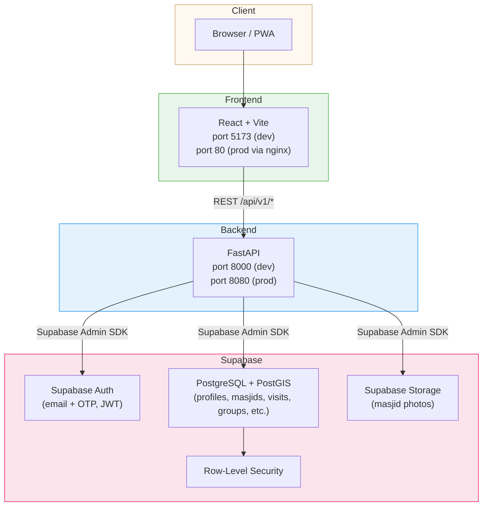

### Docker Compose (Dev vs Prod)

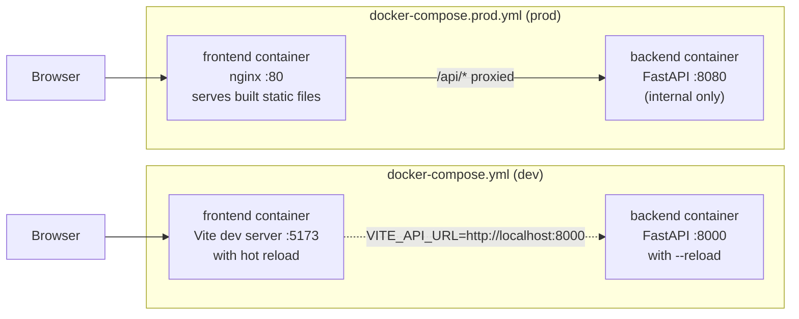

---

## User Flow

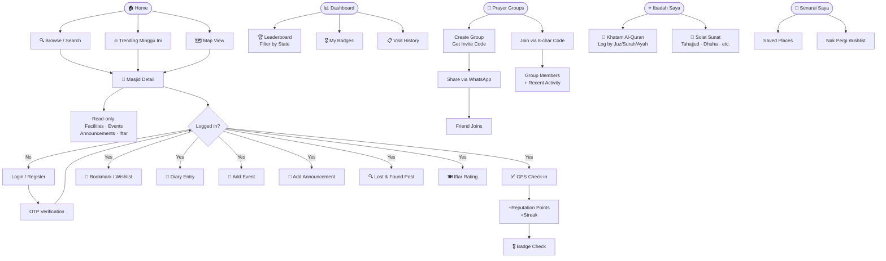

---

## Tech Stack

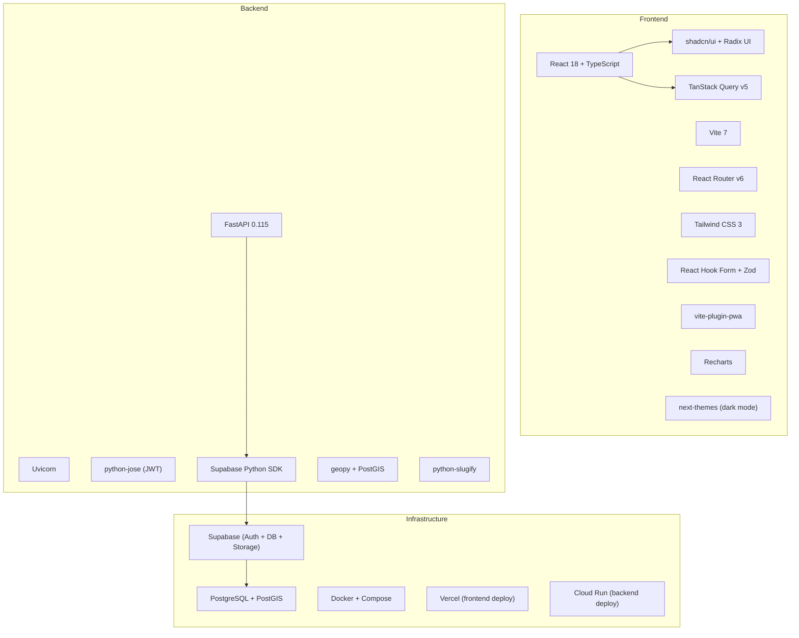

---

## Component Overview

```mermaid
graph TD
    App["App.tsx\n(Routes + Providers)"] --> Header
    App --> Footer
    App --> Pages

    subgraph Pages
        Index["Index\n(Home + Trending)"]
        Browse["BrowseMasjid\n(Search + Filters)"]
        Detail["MasjidDetail\n(Full info + Community)"]
        Dashboard["TrackingDashboard\n(Stats + Leaderboard)"]
        Groups["PrayerGroups\n(List + Create + Join)"]
        GroupDetail["PrayerGroupDetail\n(Members + Activity)"]
        Bookmarks["Bookmarks\n(Saved + Wishlist tabs)"]
        Ibadah["IbadahSaya\n(Khatam + Solat Sunat tabs)"]
        Map["MapView"]
        Profile["Profile"]
        AddMasjid["AddMasjid"]
        Admin["AdminPanel"]
    end

    subgraph "MasjidDetail Sections"
        CI["Check-in Widget"]
        BK["Bookmark / Wishlist Buttons"]
        LU["Live Updates"]
        VF["Verification Panel"]
        ANN["Announcements + Add Form"]
        EVT["Events + Add Form"]
        DR["Diary + Entry Form"]
        LF["Lost & Found"]
        IF["Iftar Thread"]
        FAC["Facilities Detail"]
        MED["Photo Gallery"]
    end

    subgraph "Shared Components"
        MasjidCard["MasjidCard\n(cover photo + badges)"]
        HeaderComp["Header\n(nav + auth dropdown)"]
        InstallPrompt["InstallPrompt (PWA)"]
        FeedbackBtn["FeedbackButton"]
    end

    Index --> MasjidCard
    Browse --> MasjidCard
    Detail --> CI & BK & LU & VF & ANN & EVT & DR & LF & IF & FAC & MED
    App --> HeaderComp & InstallPrompt & FeedbackBtn
```

---

## Database Schema

### Core ERD

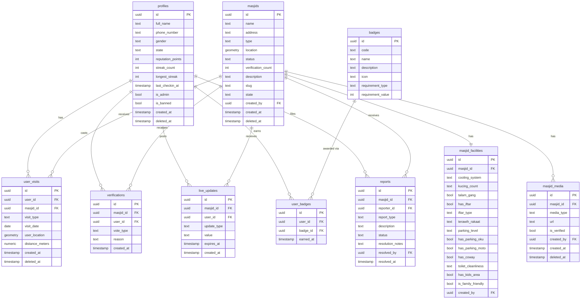

### Community & Social ERD

```mermaid
erDiagram
    bookmarks {
        uuid id PK
        uuid user_id FK
        uuid masjid_id FK
        bool is_wishlist
        timestamp created_at
    }

    diary_entries {
        uuid id PK
        uuid user_id FK
        uuid masjid_id FK
        text content
        date visit_date
        timestamp created_at
        timestamp deleted_at
    }

    khatam_logs {
        uuid id PK
        uuid user_id FK
        int juz
        int surah_from
        int ayah_from
        int surah_to
        int ayah_to
        text notes
        timestamp created_at
        timestamp deleted_at
    }

    special_prayer_logs {
        uuid id PK
        uuid user_id FK
        text prayer_type
        int rakaat
        text notes
        timestamp created_at
        timestamp deleted_at
    }

    events {
        uuid id PK
        uuid masjid_id FK
        uuid user_id FK
        text title
        text event_type
        timestamp starts_at
        timestamp ends_at
        text description
        timestamp created_at
        timestamp deleted_at
    }

    announcements {
        uuid id PK
        uuid masjid_id FK
        uuid user_id FK
        text title
        text body
        text category
        timestamp expires_at
        timestamp created_at
        timestamp deleted_at
    }

    lost_found_posts {
        uuid id PK
        uuid masjid_id FK
        uuid user_id FK
        text description
        bool is_resolved
        timestamp expires_at
        timestamp created_at
        timestamp deleted_at
    }

    iftar_threads {
        uuid id PK
        uuid masjid_id FK
        uuid user_id FK
        text iftar_type
        text description
        int rating
        text ramadan_season
        timestamp created_at
        timestamp deleted_at
    }

    trending_masjids {
        uuid id PK
        uuid masjid_id FK
        int score
        date week_of
        timestamp computed_at
    }

    prayer_groups {
        uuid id PK
        text name
        text type
        text invite_code
        uuid created_by FK
        int max_members
        timestamp created_at
        timestamp deleted_at
    }

    prayer_group_members {
        uuid id PK
        uuid group_id FK
        uuid user_id FK
        text role
        timestamp joined_at
    }

    profiles ||--o{ bookmarks : "saves"
    profiles ||--o{ diary_entries : "writes"
    profiles ||--o{ khatam_logs : "logs"
    profiles ||--o{ special_prayer_logs : "logs"
    profiles ||--o{ events : "posts"
    profiles ||--o{ announcements : "posts"
    profiles ||--o{ lost_found_posts : "posts"
    profiles ||--o{ iftar_threads : "posts"
    profiles ||--o{ prayer_groups : "creates"
    profiles ||--o{ prayer_group_members : "joins"
    masjids ||--o{ bookmarks : "bookmarked in"
    masjids ||--o{ diary_entries : "has"
    masjids ||--o{ events : "has"
    masjids ||--o{ announcements : "has"
    masjids ||--o{ lost_found_posts : "has"
    masjids ||--o{ iftar_threads : "has"
    masjids ||--o{ trending_masjids : "ranks in"
    prayer_groups ||--o{ prayer_group_members : "has"
```

---

## Data Flow Diagram

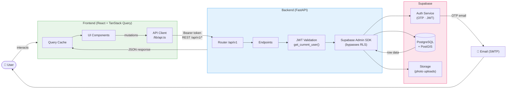

---

## Auth Flow

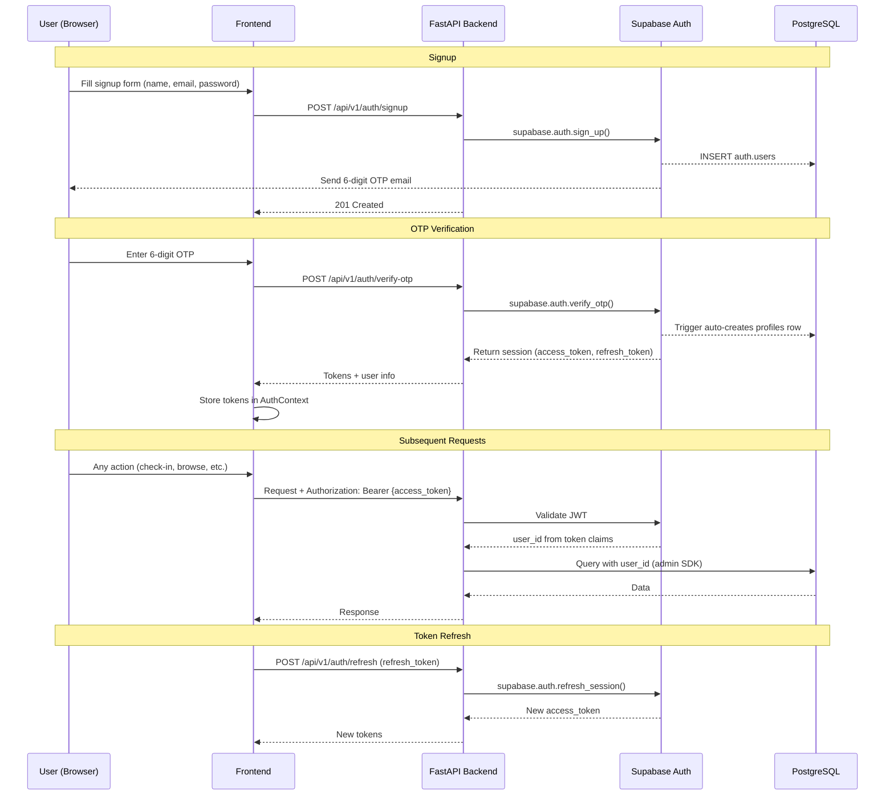

---

## Check-in Flow

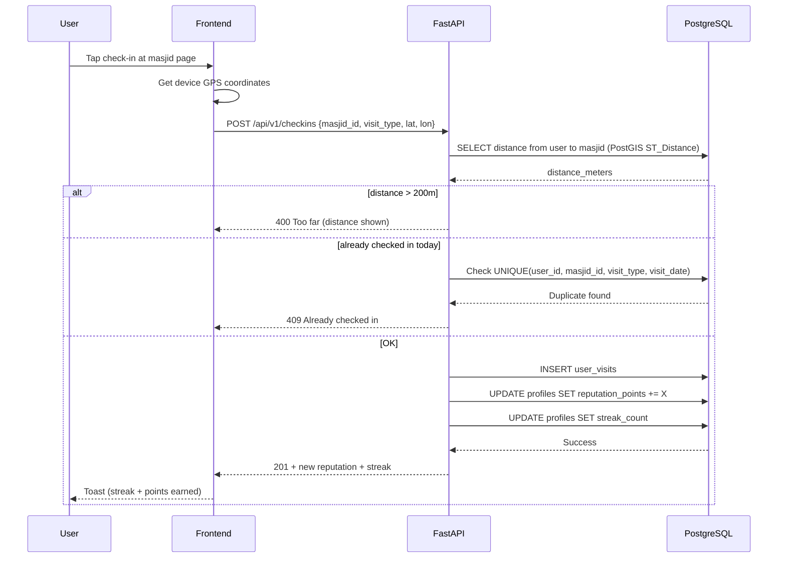

---

## Wireframe Overview

Key page layouts at a glance:

```mermaid
graph TD
    subgraph Home ["🏠 Home"]
        H1["Header (nav)"]
        H2["Hero — tagline + CTA"]
        H3["Stats bar (total masjids / visits)"]
        H4["🔥 Trending Minggu Ini (horizontal scroll)"]
        H5["Popular Masjids grid"]
        H6["Feature highlights"]
        H1 --> H2 --> H3 --> H4 --> H5 --> H6
    end

    subgraph Browse ["🔍 Browse"]
        B1["Search input"]
        B2["Type chips (Masjid · Surau · Musolla)"]
        B3["Facility filter tags (scrollable)"]
        B4["Sort toggle"]
        B5["MasjidCard grid\n(cover photo + badges)"]
        B1 --> B2 --> B3 --> B4 --> B5
    end

    subgraph MasjidDetail ["📍 Masjid Detail"]
        D1["Photo gallery"]
        D2["Name · Type · Address · Status"]
        D3["Check-in button (GPS)"]
        D4["Bookmark / Wishlist toggles"]
        D5["Facilities panel"]
        D6["Live Updates"]
        D7["Announcements + Events"]
        D8["Diary · Lost&Found · Iftar Thread"]
        D1 --> D2 --> D3 --> D4 --> D5 --> D6 --> D7 --> D8
    end

    subgraph Dashboard ["📊 Dashboard"]
        K1["Visit stats (total · streak · unique)"]
        K2["Visit calendar heatmap"]
        K3["Badges earned"]
        K4["Leaderboard (state filter + censored names)"]
        K1 --> K2 --> K3 --> K4
    end

    subgraph Groups ["👥 Prayer Groups"]
        G1["Buat Kumpulan / Join dengan Kod buttons"]
        G2["Create form (name + type)"]
        G3["Join form (8-char code input)"]
        G4["Groups list → Group Detail"]
        G4 --> G5["Invite code (large mono) + Copy + WhatsApp"]
        G4 --> G6["Members list + Recent activity feed"]
        G1 --> G2
        G1 --> G3
        G1 --> G4
    end
```

---

## API Overview

Base URL: `http://localhost:8000/api/v1`

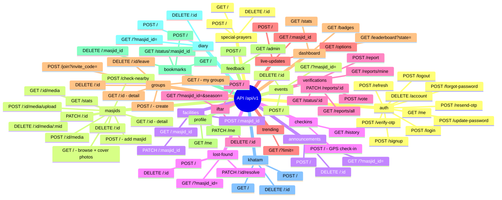

---

## Environment Variables

### Backend (`backend/.env`)

```env
# App
APP_NAME=SinggahLuhh API
APP_VERSION=0.1.0
DEBUG=true
ENVIRONMENT=development

# Supabase
SUPABASE_URL=https://<project>.supabase.co
SUPABASE_ANON_KEY=<anon key>
SUPABASE_SERVICE_KEY=<service role key>

# Security (generate: openssl rand -hex 32)
SECRET_KEY=<your secret>
ALGORITHM=HS256
ACCESS_TOKEN_EXPIRE_MINUTES=30
REFRESH_TOKEN_EXPIRE_DAYS=7

# CORS (comma-separated JSON array)
ALLOWED_ORIGINS=["http://localhost:5173"]

# Email (SMTP)
SMTP_HOST=
SMTP_PORT=587
SMTP_USER=
SMTP_PASSWORD=
EMAIL_FROM=noreply@singgahluhh.com

# Business rules
MASJID_VERIFY_THRESHOLD=3
MASJID_DUPLICATE_RADIUS_METERS=100
```

### Frontend (`frontend/.env`)

```env
VITE_API_URL=http://localhost:8000
VITE_SUPABASE_URL=https://<project>.supabase.co
VITE_SUPABASE_ANON_KEY=<anon key>
```

---

## Running with Docker

### Prerequisites
- Docker + Docker Compose installed
- Copy `backend/.env.example` → `backend/.env` and fill in values

### Development (hot reload for both services)

```bash
docker compose up --build
```

| Service | URL |
|---|---|
| Frontend (Vite) | http://localhost:5173 |
| Backend (FastAPI) | http://localhost:8000 |
| API Docs (Swagger) | http://localhost:8000/docs |

Source code is volume-mounted — changes reflect immediately without rebuilding.

### Production (nginx + optimised build)

```bash
docker compose -f docker-compose.prod.yml up --build
```

| Service | URL |
|---|---|
| App (nginx) | http://localhost:80 |
| Backend | internal only (no exposed port) |

In prod, nginx serves the built frontend and proxies `/api/*` requests to the backend container.

### Useful commands

```bash
# Stop all containers
docker compose down

# Rebuild single service
docker compose up --build backend

# View logs
docker compose logs -f backend
docker compose logs -f frontend

# Open shell in running container
docker compose exec backend bash
```

---

## Project Structure

```
SinggahLuhh/
├── docker-compose.yml              # Dev: Vite + FastAPI with hot reload
├── docker-compose.prod.yml         # Prod: nginx + FastAPI
│
├── backend/
│   ├── Dockerfile
│   ├── .env                        # Secret — not committed
│   ├── .env.example
│   ├── requirements.txt
│   └── app/
│       ├── main.py                 # FastAPI app, CORS, lifespan
│       ├── core/
│       │   ├── config.py           # Settings (pydantic-settings)
│       │   ├── deps.py             # get_current_user dependency
│       │   └── supabase.py         # Admin + anon client factory
│       ├── schemas/
│       │   └── base.py             # CamelModel (snake → camelCase)
│       └── api/v1/
│           ├── router.py           # Master router
│           └── endpoints/
│               ├── auth.py
│               ├── masjids_new.py  # Browse (with cover photo), detail, media upload
│               ├── facilities_new.py
│               ├── checkin.py
│               ├── live_updates_new.py
│               ├── verification_new.py
│               ├── dashboard.py    # Stats, badges, leaderboard (state filter)
│               ├── profile.py
│               ├── bookmarks.py
│               ├── diary.py
│               ├── khatam.py
│               ├── special_prayers.py
│               ├── events.py
│               ├── announcements.py
│               ├── lost_found.py
│               ├── iftar.py
│               ├── trending.py     # Weekly trending (auto-compute via RPC)
│               ├── prayer_groups.py
│               └── feedback.py
│
└── frontend/
    ├── Dockerfile                  # Multi-stage: dev (Vite) + prod (nginx)
    ├── nginx.conf                  # SPA routing + /api proxy
    ├── .env
    ├── vite.config.ts
    ├── tailwind.config.ts
    └── src/
        ├── main.tsx
        ├── App.tsx                 # All routes
        ├── types/
        │   └── index.ts            # Masjid, Facilities, Visit, etc.
        ├── contexts/
        │   └── AuthContext.tsx     # Tokens, user state, login/logout
        ├── lib/
        │   ├── api.ts              # All API calls (groupsApi, trendingApi, etc.)
        │   ├── constants.ts        # QUICK_TAGS, MALAYSIA_STATES, etc.
        │   └── utils.ts            # toTitleCase, censorName, cn()
        ├── hooks/
        │   └── use-toast.ts
        ├── components/
        │   ├── Header.tsx          # Nav with auth dropdown + mobile menu
        │   ├── Footer.tsx
        │   ├── MasjidCard.tsx      # Card with cover photo + type/facility badges
        │   ├── InstallPrompt.tsx   # PWA install banner
        │   └── FeedbackButton.tsx
        └── pages/
            ├── Index.tsx           # Home: stats + trending + popular
            ├── BrowseMasjid.tsx    # Search, type/facility filters
            ├── MasjidDetail.tsx    # Full detail + check-in + community sections
            ├── TrackingDashboard.tsx  # Stats, leaderboard, badges, history
            ├── MapView.tsx
            ├── AddMasjid.tsx
            ├── Bookmarks.tsx       # Saved + Wishlist tabs
            ├── IbadahSaya.tsx      # Khatam Al-Quran + Solat Sunat tabs
            ├── PrayerGroups.tsx    # My groups + create + join
            ├── PrayerGroupDetail.tsx  # Members, activity, invite code sharing
            ├── Profile.tsx
            ├── AdminPanel.tsx
            ├── Auth.tsx
            ├── ResetPassword.tsx
            ├── PrivacyPolicy.tsx
            ├── Terms.tsx
            ├── FAQ.tsx
            ├── Changelog.tsx
            └── NotFound.tsx
```
