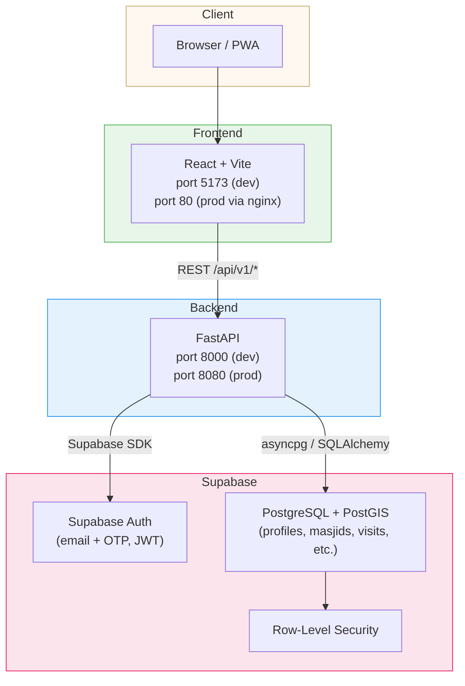
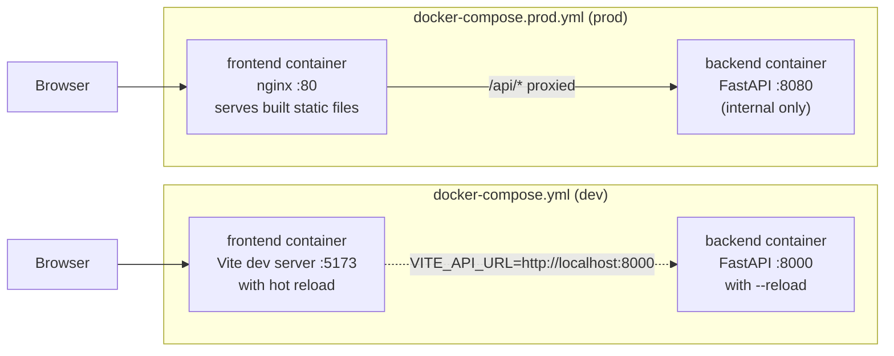
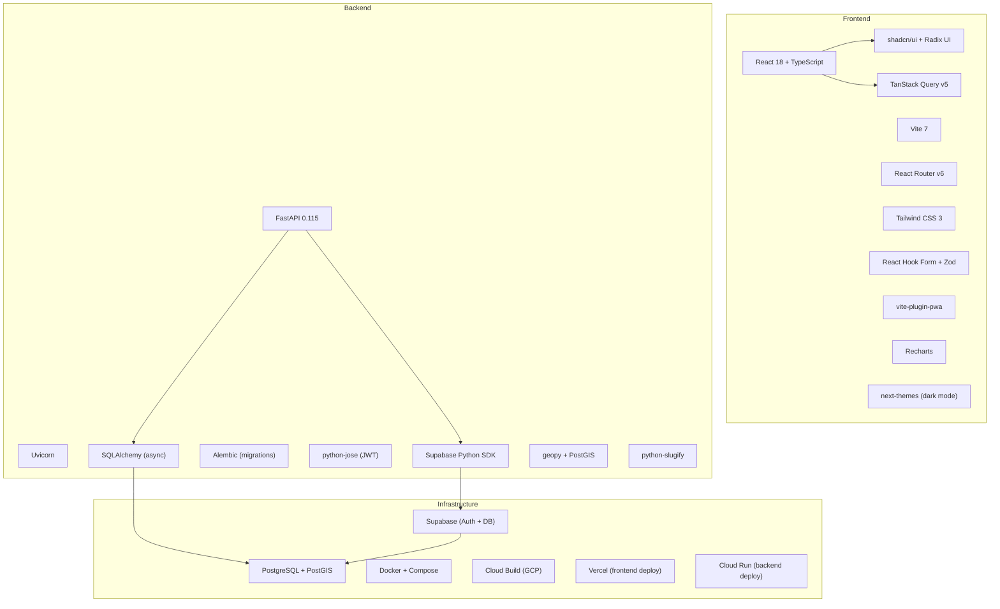
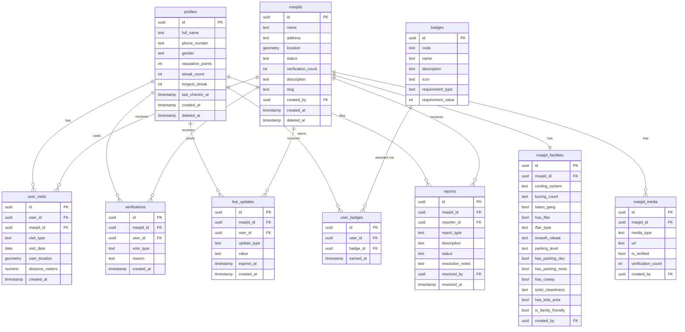
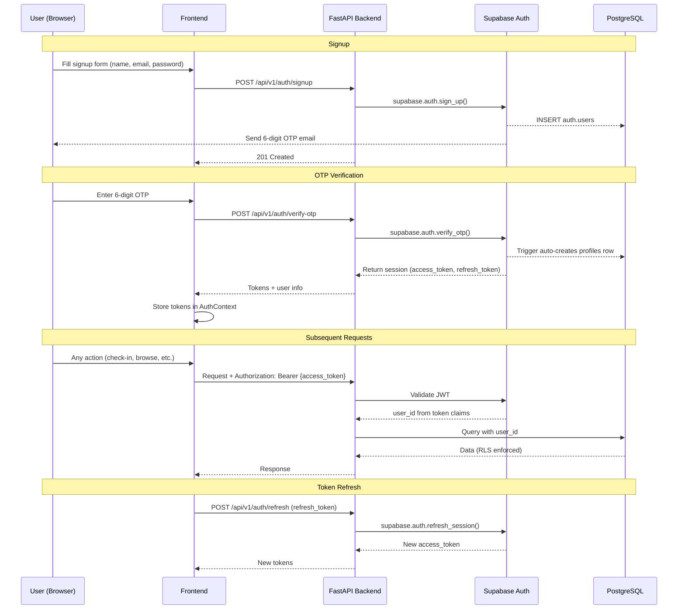
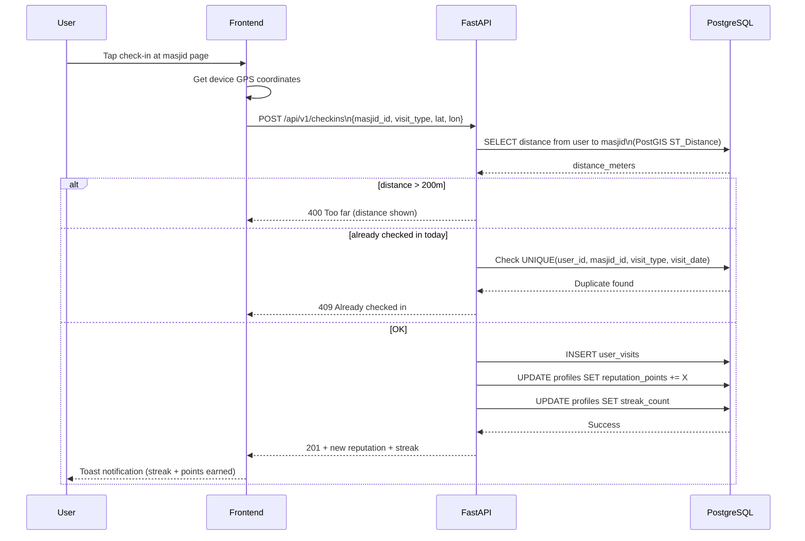
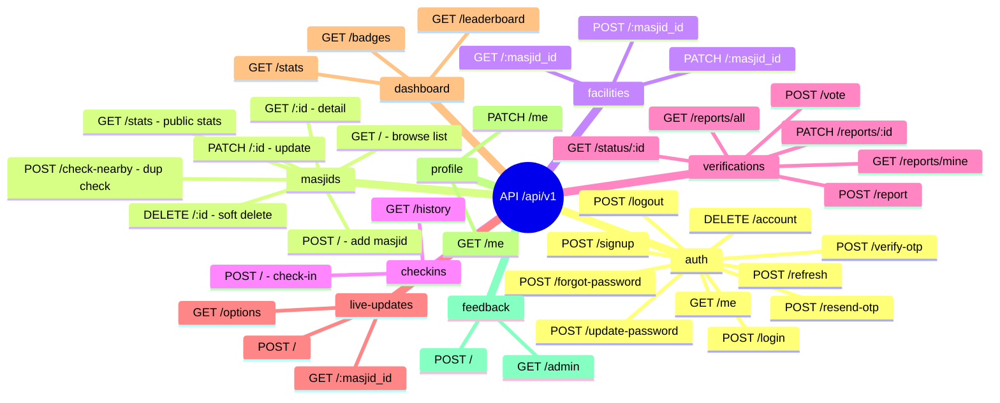

# SinggahLuhh

**Cari, jejak, dan kongsi masjid berhampiran anda.**

SinggahLuhh is a community-driven mosque discovery and visit tracking app for Malaysia. Users discover mosques, check in to earn streaks and reputation, contribute facility info, and share real-time crowd updates — all wrapped in gamification that rewards the Malaysian jemaah spirit.

---

## Table of Contents

- [Features](#features)
- [System Architecture](#system-architecture)
- [Tech Stack](#tech-stack)
- [Database Schema](#database-schema)
- [Auth Flow](#auth-flow)
- [Check-in Flow](#check-in-flow)
- [API Overview](#api-overview)
- [Environment Variables](#environment-variables)
- [Running with Docker](#running-with-docker)
- [Project Structure](#project-structure)

---

## Features

### Mosque Discovery
- Browse all verified mosques with search and filters
- View full facility details per mosque (AC, parking, toilets, etc.)
- Slug-based URLs (`/masjid/masjid-al-amin-abc123`)
- 100m radius duplicate check before adding a new mosque

### Malaysian-Specific Facilities
| Category | Details |
|---|---|
| Cooling | Full AC / partial AC / HVLS fans / regular fans / panas |
| Kucing | Count of cats (ramai / orange / a few / none) |
| Parking | Difficulty level, OKU spaces, motorcycle parking |
| Wanita | Telekung availability + cleanliness, wudhu seating |
| Food | Talam gang flag, iftar type (kotak / talam / buffet / DIY), menu |
| Solat | Terawih rakaat count (8 / 11 / 20 / 23) |
| Amenities | Coway dispenser, toilet cleanliness + floor condition |
| Extra | Tourist-friendly, tahfiz, library, kids area, family-friendly |

### Visit Tracking (Langkah)
- GPS check-in with geofencing (must be within 200m)
- Track prayer type: Subuh, Zohor, Asar, Maghrib, Isyak, Jumaat, Terawih, Iftar, Kuliah
- Prevent duplicate check-ins for same mosque + prayer + day
- Daily streak tracking (resets if you miss a day)

### Gamification
- **Reputation Points** earned via contributions:
  - Subuh check-in → 15 pts
  - Other prayers → 10 pts
  - Add facilities → 10 pts
  - Live update → 5 pts
  - Vote → 5 pts
- **Badges** for achievements:
  | Badge | Requirement |
  |---|---|
  | Subuh Warrior | 7-day streak |
  | Musafir Tegar | Visit mosques in 3 different states |
  | AJK Iftar | First to post an iftar menu update |
  | Kucing Lover | Update kucing info at 5 mosques |
  | Ramadan Champion | 20 terawih check-ins |
  | Masjid Hunter | 50 unique mosques visited |
- **Leaderboard** — top users by reputation, with your own rank shown

### Community Verification
- Upvote / downvote mosque submissions (toggle, cannot vote own submissions)
- Downvotes require a reason
- Auto-verify mosque at 3+ upvotes (database trigger)

### Live Crowdsourced Updates
- Post real-time conditions: saf status, parking, iftar menu, crowd level
- Auto-expire: 45 min for prayer/parking/crowd, 24h for iftar menu
- Active updates shown on mosque detail page

### Reports & Moderation
- Report mosque data issues: doesn't exist, wrong location, duplicate, inappropriate, wrong info
- Admin panel to review and resolve reports with notes

### Auth & Profile
- Email + password signup with 6-digit OTP email verification
- Forgot password via email reset link
- Edit profile (name, phone, gender)
- JWT-based sessions (30 min access token, 7-day refresh token)
- Account deletion (cascades all user data)

### Other
- Feedback form (floating button, always accessible)
- PWA — installable on mobile
- FAQ, Changelog, Privacy Policy, Terms pages
- Public homepage stats (total mosques, verified count, total visits)

---

## System Architecture



### Docker Compose (Dev vs Prod)



---

## Tech Stack



---

## Database Schema



---

## Auth Flow



---

## Check-in Flow



---

## API Overview

Base URL: `http://localhost:8000/api/v1`



---

## Environment Variables

### Backend (`backend/.env`)

```env
# App
APP_NAME=SinggahLuhh API
APP_VERSION=0.1.0
DEBUG=true
ENVIRONMENT=development

# Database (Supabase connection string)
DATABASE_URL=postgresql+asyncpg://postgres:<password>@<host>:5432/postgres

# Supabase
SUPABASE_URL=https://<project>.supabase.co
SUPABASE_ANON_KEY=<anon key>
SUPABASE_SERVICE_KEY=<service role key>

# Security (generate: openssl rand -hex 32)
SECRET_KEY=<your secret>
ALGORITHM=HS256
ACCESS_TOKEN_EXPIRE_MINUTES=30
REFRESH_TOKEN_EXPIRE_DAYS=7

# CORS (comma-separated JSON array)
ALLOWED_ORIGINS=["http://localhost:5173"]

# Google OAuth (optional)
GOOGLE_CLIENT_ID=
GOOGLE_CLIENT_SECRET=
GOOGLE_REDIRECT_URI=http://localhost:8000/api/v1/auth/google/callback

# Email (SMTP)
SMTP_HOST=
SMTP_PORT=587
SMTP_USER=
SMTP_PASSWORD=
EMAIL_FROM=noreply@singgahluhh.com

# Business rules
MASJID_VERIFY_THRESHOLD=3
MASJID_DUPLICATE_RADIUS_METERS=100
```

### Frontend (`frontend/.env`)

```env
VITE_API_URL=http://localhost:8000
```

---

## Running with Docker

### Prerequisites
- Docker + Docker Compose installed
- Copy `backend/.env.example` → `backend/.env` and fill in values

### Development (hot reload for both services)

```bash
docker compose up --build
```

| Service | URL |
|---|---|
| Frontend (Vite) | http://localhost:5173 |
| Backend (FastAPI) | http://localhost:8000 |
| API Docs (Swagger) | http://localhost:8000/docs |

Source code is volume-mounted — changes reflect immediately without rebuilding.

### Production (nginx + optimised build)

```bash
docker compose -f docker-compose.prod.yml up --build
```

| Service | URL |
|---|---|
| App (nginx) | http://localhost:80 |
| Backend | internal only (no exposed port) |

In prod, nginx serves the built frontend and proxies `/api/*` requests to the backend container.

### Useful commands

```bash
# Stop all containers
docker compose down

# Rebuild single service
docker compose up --build backend

# View logs
docker compose logs -f backend
docker compose logs -f frontend

# Open shell in running container
docker compose exec backend bash
```

---

## Project Structure

```
SinggahLuhh/
├── docker-compose.yml          # Dev: Vite + FastAPI with hot reload
├── docker-compose.prod.yml     # Prod: nginx + FastAPI
├── .dockerignore
│
├── backend/
│   ├── Dockerfile
│   ├── .dockerignore
│   ├── .env                    # Secret — not committed
│   ├── .env.example            # Template
│   ├── requirements.txt
│   └── app/
│       ├── main.py             # FastAPI app, CORS, lifespan
│       ├── core/
│       │   └── config.py       # Settings (pydantic-settings)
│       ├── api/
│       │   └── v1/
│       │       ├── router.py   # Master router
│       │       └── endpoints/  # auth, masjids, checkins, etc.
│       └── schemas/            # Pydantic request/response models
│
└── frontend/
    ├── Dockerfile              # Multi-stage: dev (Vite) + prod (nginx)
    ├── nginx.conf              # SPA routing + /api proxy
    ├── .dockerignore
    ├── .env                    # VITE_API_URL
    ├── vite.config.ts
    ├── tailwind.config.ts
    ├── index.html
    └── src/
        ├── main.tsx
        ├── App.tsx             # Routes
        ├── contexts/           # AuthContext (tokens, user state)
        ├── pages/              # Home, Browse, MasjidDetail, Tracking, etc.
        ├── components/         # Shared UI components
        ├── hooks/              # Custom React hooks
        ├── lib/                # API client, utils
        └── types/              # TypeScript types
```
